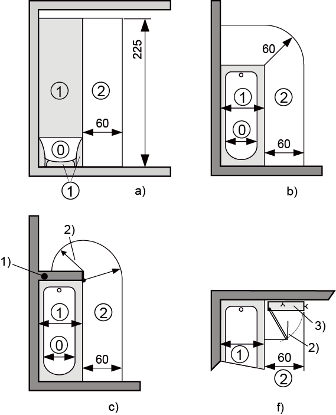
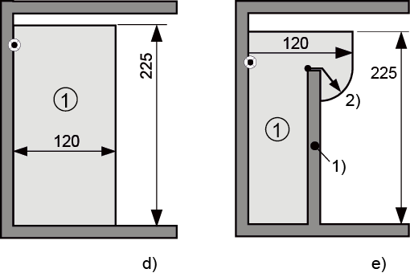
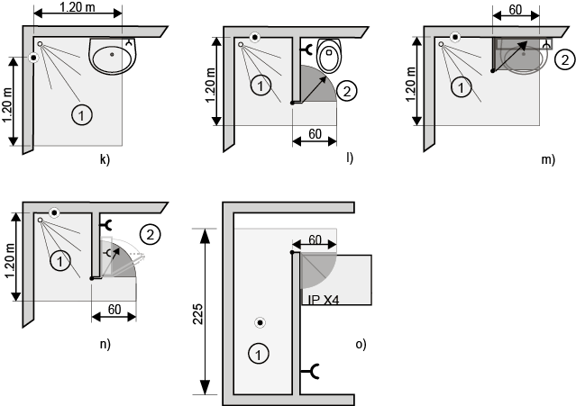
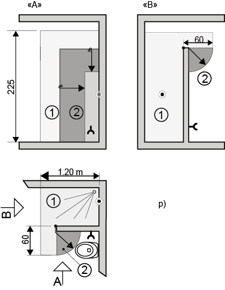

# Einleitung
In der [_NIV (**N**iederspannungs **I**nstallations **V**erordnung) Artikel 24_](https://www.admin.ch/opc/de/classified-compilation/20012238/index.html#a24) wird die Baubegleitende Erstprüfung gefordert und wie folgt beschrieben:

>Baubegleitende Erstprüfung und betriebsinterne Schlusskontrolle

>1. Vor der Inbetriebnahme einer elektrischen Installation oder von Teilen davon ist eine baubegleitende Erstprüfung durchzuführen. Diese Erstprüfung ist zu protokollieren.

In der _NIN Kap 6.1_ ist genau und praktisch beschrieben, wie eine Erstprüfung ablaufen soll:

Hier mal nur soviel (Zitat aus NIN 2015 Compact):
>**6.1.1. Allgemeines**
>1. _Jede elektrische Anlage muss_, bevor sie vom Benutzer in Betrieb genommen wird, gemäss NIV Art. 24 während der Errichtung bzw. bei der Fertigstellung geprüft werden, um nachzuweisen, dass sie den sicherheitstechnischen Anforderungen entspricht.

>prüfen umfasst alle Tätigkeiten, mit denen festgestellt wird, ob die Ausführung der gesammten Anlage der NIN entspricht.

>Sie beinhaltet:
* die Sichtprüfung
* das Erproben
* die Messungen

<a href="#">Zurück nach oben ⬆️</a> 

---
### Aus der Praxis 🔨
Nach über 20 Jahren im Beruf, davon über 8 Jahre als Sicherheitsberater,
weiss ich, dass diese Kontrollen keine Schikane, sondern eine Routine schafft, die uns Elektrikern hilft, hohe Qualität mit geringem Aufwand zu erreichen.
Viele Schäden und (Fast-) Unfälle können verhindert werden.
Und für uns ist es wie eine Versicherung:
Wir haben die Kontrolle durchgeführt, die Werte sind in Ordnung, ich habe gute Arbeit geleistet.

Genauso wie wir eine Wasserwaage ja nicht brauchen, um die Abdeckung gerade zu montieren, sondern um zu beweisen, dass wir ein super Auge haben 😉, 
so machen wir auch die Erstprüfung nur, um zu zeigen, dass wir ausgezeichnete Arbeit gemacht haben. Wäre ja auch schade, wenn das dann niemand merkt 👏.

<a href="#">Zurück nach oben ⬆️</a> 

---
# Und was heisst das konkret?

### Allgemeines

<ol>
  <li>Jede elektrische Anlage muss, bevor sie vom Benützer in Betrieb genommen wird, gemäss NIV (Art. 24) während der Errichtung bzw. bei Fertigstellung geprüft werden, um nachzuweisen, dass sie den sicherheitstechnischen Anforderungen entspricht. 
  <i>also jede!</i></li>
  <li>Für die Prüfung der Anlage müssen entsprechende Unterlagen zur Verfügung stehen, aus welchen Aufbau der Stromkreise, Raumart und Einteilung, Art der Schutzmassnahmen und dgl. ersichtlich sind. 
  <blockquote>📜 <i>Schema, Legende, Installationsanzeige, Brandschutzkonzept, Bedienungsanleitungen, etc.</i></blockquote></li>
  <li>Während der Prüfung müssen Vorsichtsmassnahmen getroffen werden, um eine Gefährdung von Personen, Nutztieren und Sachwerten auszuschliessen. 
  <blockquote>💡 <em>Was passiert wenn wir ausschalten und messen?  
  Licht, Lüftung, Lift, Alarmanlagen etc. und nicht vergessen die Messspannung!  
  Ist alles Isoliert?</em></blockquote></li>
  <li>Bei Erweiterung oder Änderung einer bereits bestehenden Anlage ist nachzuweisen, dass die Sicherheit der bestehenden Anlage nicht beeinträchtigt wird.  
  <blockquote>🔌 <em>Das heisst, wenn wir z. B. ein Tableau auschwechseln, müssen wir in jedem Stromkreis eine Stichprobe machen.</em></blockquote></li>
</ol>

### Sichtprüfungen

<ol>
  <li>Die Sichtprüfung soll:
  <ul>
    <li>vor dem Erproben und Messen und</li>
    <li>bevor die Anlage in Betrieb genommen wird und</li>
    <li>vorzugsweise bei ausgeschalteter Anlage durchgeführt werden.</li>
 </ul>
 
Eine Sichtprüfung bedeutet eine Untersuchung mit allen Sinnen 👁️ 🐽 🐰 🖐️, um die richtige Auswahl und die ordnungsgemässe Errichtung der elektrischen Betriebsmittel (Installation) nachzuweisen.

  </li>

  <li>Die Sichtprüfung ortsfest installierter Betriebsmittel muss nachweisen, dass die Installation unter anderem folgenden Anforderungen entspricht:</li>
    <ul>
      <li>Übereinstimmung mit den Sicherheitsanforderungen, z. B. Berührungsschutz gewährleistet, keine Beschädigungen und dgl.</li>
      <li>☔ Korrekte Auswahl der Betriebsmittel entsprechend der Raumart</li>
      <li>Vorhandensein der vorgeschriebenen Kenn- und Prüfzeichen</li>
      <li>📜 Beachtung allfällig vom Hersteller mitgelieferter technischer Unterlagen</li>
    </ul>
  <li>In die Sichtprüfung sind ferner mindestens folgende Punkte einzubeziehen:</li>
    <ol type="a">
      <li>⚡ Anwendung von Schutzmassnahmen gegen elektrischen Schlag gemäss NIN 4.1</li>
      <li>🔥 Vorhandensein von Brandabschottungen, Schutz gegen thermische Einwirkungen, Brandausbreitungen etc.</li>
      <li>Auswahl der Leiter bezüglich der Strombelastbarkeit und Spannungsfall</li>
      <li>Auswahl und Einstellung von Schutz- und Überwachungseinrichtungen</li>
      <li>Auswahl und Anordnung von Trenn- und Schaltgeräten  
      <blockquote><em>Anlagen, die nicht im selben Raum wie die Sciherungen sind, brauchen einen Serviceschalter, z. B. Wechselrichter von Photovoltaikanlagen</em></blockquote></li>
      <li>Auswahl der Betriebsmittel und der Schutzmassnahmen entsprechend den äusseren Einflüssen</li>
      <li>Kennzeichnung der Schutzleiter, PEN-Leiter und Neutralleiter</li>
      <li>Vorhandensein von technischen Unterlagen, Schemata, Warn-, Verbotszeichen und anderen ähnlichen Informationen</li>
      <li>Kennzeichnung der Stromkreise, Überstrom-Schutzeinrichtungen, Schalter, Klemmen etc.</li>
      <li>Vorhandensein und richtige Verwendung von Schutzleitern, einschliesslich Schutz-Potenzialausgleichsleitern für den Schutz-Potenzialausgleich und den zusätzlichen Schutz-Potenzialausgleich</li>
      <li>Leiterverbindungen bezüglich Schutz gegen Selbstlockerung, Bemessung und Anordnung  
      <blockquote><em>Schrauben, die Teile verbinden, die dem Schutz-Potenzialausgleich dienen, müssen gegen Selbstlockerung geschütz sein.</em></blockquote></li>
      <li>Leichte Zugänglichkeit der Betriebsmittel, die bedient und gewartet werden müssen.</li>

    </ol>
    
Die Sichtprüfung muss die besonderen Anforderungen für Anlagen oder Räume besonderer Art umfassen. 
    <blockquote><em>Also sind für Landwirtschaft, Bad, Schwimmbad, Schreinerei, etc. die entsprechenden Normen (NIN Kap. 7) zu berücksichtigen.</em></blockquote>

</ol>

### Erproben und Messen

#### 6.1.3.1 Allgemeines

<ol>
<li>
    
Die nachstehenden Prüfungen und Messungen sind, sofern zutreffend, in jedem Fall durchzuführen, vorzugsweise in der folgenden Reihenfolge:

</li>
<ul>
  <li>Durchgängigkeit der Leiter, insbesondere die Leitfähigkeit des Schutzleiters, des Schutz-Potenzialausgleichsleiters und des zusätzlichen Schutz-Potenzialausgleichsleiters  
  <blockquote><em>Mit der Kabelrolle und dem Messgerät. Einstellung RLo. 
  Die Messwerte sollten &le; 1 &Omega; sein.</em></blockquote></li>
  <li>Isolationswiderstand der elektrischen Anlage  
  <blockquote><em>Vorzugsweise am Tableau messen.  
  Messgleichspannung 50 V für die erste Messung, 500 V für die zweite Messung (ausser das Messgerät fährt bei der Messung die Spannung langsam hoch) 
  Immer in folgender Reihenfolge messen: PE-N, PE-L1/L2/L3 
  ⚠️ <b>Ist RIso PE-N schlecht, nicht weitermessen!</b> ⚠️  
  Der Isolationswiderstand muss bei Neuanlagen &ge; 0.1 M&Omega; sein.</em></blockquote></li>
  <li>Wirksamkeit des Schutzes durch SELV, PELV oder durch Schutztrennung</li>
  <li>Widerstand/ Impedanz von isolierenden Fussböden und isolierenden Wänden</li>
  <li>Schutz durch automatische Abschaltung der Stromversorgung 
  <blockquote><em><strong>Kurzschlussstrommessung</strong> 
  Mit dieser Messung kann auf die Abschaltzeit geschlossen werden.  
  Folgende Faustformel kann für Endstromkreise, es gelten &le; 0.4 s Abschaltzeit, angewendet werden:  
  LSC &rarr; IK &ge; 15*IN</em> 
  LSB &rarr; IK &ge; 7*IN</em> 
  Für Verteilerstromkreise gelten eine Abschaltzeit von &le; 5 s, was ungefähr folgenden minimalen Kurzschlussstrom erfordert:  
  LSD &rarr; IK &ge; 10*IN</em> 
  LSC &rarr; IK &ge; 10*IN</em> 
  Diazed &rarr; IK &ge; 6*IN</em> 
  NH00 &rarr; IK &ge; 7*IN</em> 
  Sind die Messwerte nahe bei diesen Grenzwerten, sind die Datenblätter der Hersteller zu konsultieren hier ein Beispiel für <a href="http://www.hager.ch/solr-suche/238159.htm?solr%5Bq%5D=ausl%C3%B6sekennlinie&navlang=de">Hager LS</a>
</blockquote></li>
  <li>zusätzlicher Schutz</li>
  <li>Polarität (Anschluss von Steckdosen, Schalt- und Schutzeinrichtungen im Aussen-/ Neutralleiter)</li>
  <li>Drehsinn/ Drehrichtung</li>
  <li>Funktion und Betrieb</li>
  <li>Spannungsfall</li>
</ul>

<b>👉 Wenn beim Erproben und Messen ein Fehler festgestellt wird, sind nach Behebung des Fehlers diese Prüfung und jede vorhergehende Prüfung, die durch den Fehler möglicherweise beeinflusst wurde, zu wiederholen.</b>

<i>
<b>Anmerkung:</b>

Wenn die Prüfung in möglicherweise explosiver Atmosphäre durchgeführt wird, müssen Sicherheitsvorkehrungen gemäss EN 60079-17 und 61241-14 getroffen werden. (B+E)
</i>
</ol>

### 6.1.4 Erstellen eines Prüfberichts über die Erstprüfung

<ol>
<li>Nach Beendigung der Prüfung einer neuen Anlage oder von Erweiterungen oder Änderungen in einer bestehenden Anlage muss ein Bericht inkl. Mess- und Prüfprotokoll erstellt werden.  
Diese Dokumente müssen Details des Anlagenumfangs, welche durch den Bericht abgedeckt sind, zusammen mit einer Aufzeichnung über die Sichtprüfung und die Ergebnisse der Erprobungen und Messungen umfassen.</li>

Alle Fehler oder fehlende Teile, die während der Prüfung der Anlage erkannt werden, müssen korrigiert werden, bevor der Errichter der Anlage erklärt, dass diese Anlage die Anforderungen der Normen erfüllt.

Im weiteren müssen die Anforderungen der <a href="http://https://www.admin.ch/opc/de/classified-compilation/20012238/index.html#a35">NIV Art. 35</a> erfüllt werden.

</ol>

<a href="#">Zurück nach oben ⬆️</a> 

---
## Und hier kompakt als Checkliste

### Sichtprüfung
<dl>
<dt><b>Hausanschlusskasten Aussenkasten:</b></dt>
<dd>🗵 Zugänglichkeit gewährleistet</dd>
<dd>🗵 abgehende Leitungen dem Querschnitt entsprechend abgesichert</dd>
<dd>🗵 NH- Sicherungen mit max. Nennstromstärke und Trägheitsgrad beschriftet</dd>
<dd>🗵 Phasenreihenfolge L1/L2/L3 (br/s/gr) eingehalten</dd>
<dd>🗵 spannungsführende Teile abgedeckt! Öffnungen abgedichtet</dd>
<dd>🗵 alle Plombiervorrichtungen vorhanden (Steuerklemmen etc.)</dd>
<dt><b>Schutzmassnahmen</b></dt>
<dd>🗵 Fundamenterder erstellt und richtig angeschlossen</dd>
<dd>🗵 Erdungsleitung ausgeführt und richtig angeschlossen</dd>
<dd>🗵 Wassermesser, Ventile und dgl. überbrückt</dd>
<dd>🗵 Schutzsystem TN-S, TN-C, TN-C-S gemäss NIN 4.1.3.1 ausgeführt</dd>
</dl>
<dl>
<dt><b>Schalt- und Verteilanlagen</b></dt>
<dd>🗵 Zugänglichkeit und minimale Abmessungen gewährleistet NIN 5.1.3.</dd>
<dd>🗵 Abstände gegen brennbare Gebäudeteile oder wärmeisolierende Unterlagen</dd>
<dd>🗵 abgehende Leitungen dem Querschnitt entsprechend abgesichert</dd>
<dd>🗵 Tarifapparate, Überstromunterbrecher usw. entsprechend beschriftet</dd>
<dd>🗵 Klemmen angezogen, Öffnungen abgedichtet, spannungsführende Teile abgedeckt</dd>
<dd>🗵 NH- Sicherungen mit max. Nennstromstärke und Trägheitsgrad beschriftet</dd>
<dd>🗵 Selektivität der Überstromunterbrecher gewährleistet I rev. Schema deponiert</dd>
<dd>🗵 Tarifsteurerung, Freigabe- und Sperrsteuerungen gern. Inst.Anzeige. ausgeführt</dd>
<dd>🗵 Drehfeld am Zähler richtig</dd>
<dd>🗵 Schaltgerätekombination (SGK) Stückprüfung inkl. Prüfprotokoll durchgeführt, Typenschild angebracht.</dd>
</dl>
<dl>
<dt><b>Licht-, Steckdosen- und Apparateinstallationen</b></dt>
<dd>🗵 Steckdosen bis 32 A FI-geschützt, Abstände Dusche und Bad gemäss NIN 7.01</dd>
<dd>🗵 Garage Abstand für Schalter, Steckdosen u. Apparate (Boiler etc.) 1 m eingehalten</dd>
<dd>🗵 keine Schutzleiter über Lampen geschlauft, Lampenwahl gemäss Raumart</dd>
<dd>🗵 Neutralleiter und Schutzleiter richtig angeschlossen und geprüft</dd>
<dd>🗵 brennbare Gebäudeteile entsprechend ausgekleidet, feuerfeste Unterlagen angebracht</dd>
<dd>🗵 Drehsinn von Drehstromsteckdosen eingehalten</dd>
<dd>🗵 Steckdosen entsprechend Raumart, Standort usw. gewählt</dd>
<dd>🗵 Leitungsquerschnitt richtig abgesichert, Passeinsätze eingesetzt</dd>
<dd>🗵 Installation entsprechend Raumart und mechanischer Beanspruchung ausgeführt</dd>
<dd>🗵 unbenutzte Lampenstellen sind isoliert</dd>
</dl>
<dl>
<dt><b>Verbraucher, Apparate</b></dt>
<dd>🗵 brennbare Gebäudeteile entsprechend ausgekleidet bzw. Unterlagen angebracht</dd>
<dd>🗵 erforderliche Schutzeinrichtungen vorhanden. (Boiler wasserseitig, elektrisch, Serviceschalter PVA, usw.)</dd>
<dd>🗵 Überstromschutz bei Motoren vorhanden und richtig eingestellt</dd>
<dd>🗵 Instruktion vorhanden und eingehalten, Schema deponiert</dd>
<dd>🗵 alle leitenden Teile mit Schutzleiter verbunden oder Sonderisoliert</dd>
<dd>🗵 Zugentlastung, Leistungsschilder, thermische Auslöser usw. vorhanden</dd>
<dd>🗵 Anlageschalter, Fremdspannungshinweise usw. vorhanden (Schilder PVA)</dd>
<dd>🗵 Sicherheitszeichen vorhanden, Nachweispflicht erfüllt, Verbraucherdaten i. O.</dd>
</dl>

### Messen

<dl>
  <dt>Kurzschlussstrom</dt>
  <dd>🗵 Kurzschlussstrom ………….. A 
  🗵 eingesetzte Sich………… A 
  🗵 Trägheitsgrad………….</dd>
  <dt>Personenschutz erfüllt</dt>
  <dd>🗵 Abschaltzeit 5 s/0,4 s;  
  🗵 Berührungsspannung <50 V/  
  🗵 Ableitstrom <0,5 mA</dd>
  <dd>🗵 alle FI-Schalter geprüft</dd>
  <dt>Isolationswiderstand</dt>
  <dd>🗵 keine Installationsseitige Verbindung N-PE vorhanden</dd>
  <dd>🗵 Isolationswiderstand RIso [MΩ]: PE-N/PE-L1/PE-L2/PE-L3: ………………. 
  ⚠️ Reihenfolge beachten. <b>Ist RIso PE-N schlecht, nicht weitermessen!</b> ⚠️</dd>
  <dt>Schutzleiterprüfung</dt>
  <dd>🗵 alle Schutzleiter richtig angeschlossen und auf Durchgang geprüft</dd>

</dl>

Ganz unten [⬇](#hilfsmittel)  haben wir einige einfache Checklisten zum herunterladen.

<a href="#">Zurück nach oben ⬆️</a> 

---

# Grundlagen

<h3>6.1 Erstprüfungen</h3>
**Zitat NIN 2015 (Stand 12.18)**

Siehe auch info 2062a

Siehe auch info 2075a

Siehe auch info 2085b

<h4>6.1.1 Allgemeines</h4>

<ol>
  <li>Jede elektrische Anlage muss, bevor sie vom Benützer in Betrieb genommen wird, gemäss NIV (Art. 24) während der Errichtung bzw. bei Fertigstellung geprüft werden, um nachzuweisen, dass sie den sicherheitstechnischen Anforderungen entspricht.</li>
  <li>Für die Prüfung der Anlage müssen entsprechende Unterlagen zur Verfügung stehen, aus welchen Aufbau der Stromkreise, Raumart und Einteilung, Art der Schutzmassnahmen und dgl. ersichtlich sind.</li>
  <li>Während der Prüfung müssen Vorsichtsmassnahmen getroffen werden, um eine Gefährdung von Personen, Nutztieren und Sachwerten auszuschliessen.</li>
  <li>Bei Erweiterung oder Änderung einer bereits bestehenden Anlage ist nachzuweisen, dass die Sicherheit der bestehenden Anlage nicht beeinträchtigt wird.</li>
</ol>

<h4>6.1.2 Sichtprüfungen</h4>

<ol>
  <li>Die Sichtprüfung soll:
  <ul>
    <li>vor dem Erproben und Messen und</li>
    <li>bevor die Anlage in Betrieb genommen wird und</li>
    <li>vorzugsweise bei ausgeschalteter Anlage durchgeführt werden.</li>
 </ul>
 
Eine Sichtprüfung bedeutet eine Untersuchung mit allen Sinnen, um die richtige Auswahl und die ordnungsgemässe Errichtung der elektrischen Betriebsmittel (Installation) nachzuweisen.

  </li>

  <li>Die Sichtprüfung ortsfest installierter Betriebsmittel muss nachweisen, dass die Installation unter anderem folgenden Anforderungen entspricht:</li>
    <ul>
      <li>Übereinstimmung mit den Sicherheitsanforderungen, z. B. Berührungsschutz gewährleistet, keine Beschädigungen und dgl.</li>
      <li>Korrekte Auswahl der Betriebsmittel entsprechend der Raumart</li>
      <li>Vorhandensein der vorgeschriebenen Kenn- und Prüfzeichen</li>
      <li>Beachtung allfällig vom Hersteller mitgelieferter technischer Unterlagen</li>
    </ul>
  <li>In die Sichtprüfung sind ferner mindestens folgende Punkte einzubeziehen:</li>
    <ol type="a">
      <li>Anwendung von Schutzmassnahmen gegen elektrischen Schlag gemäss NIN 4.1</li>
      <li>Vorhandensein von Brandabschottungen, Schutz gegen thermische Einwirkungen, Brandausbreitungen etc.</li>
      <li>Auswahl der Leiter bezüglich der Strombelastbarkeit und Spannungsfall</li>
      <li>Auswahl und Einstellung von Schutz- und Überwachungseinrichtungen</li>
      <li>Auswahl und Anordnung von Trenn- und Schaltgeräten</li>
      <li>Auswahl der Betriebsmittel und der Schutzmassnahmen entsprechend den äusseren Einflüssen</li>
      <li>Kennzeichnung der Schutzleiter, PEN-Leiter und Neutralleiter</li>
      <li>Vorhandensein von technischen Unterlagen, Schemata, Warn-, Verbotszeichen und anderen ähnlichen Informationen</li>
      <li>Kennzeichnung der Stromkreise, Überstrom-Schutzeinrichtungen, Schalter, Klemmen etc.</li>
      <li>Vorhandensein und richtige Verwendung von Schutzleitern, einschliesslich Schutz-Potenzialausgleichsleitern für den Schutz-Potenzialausgleich und den zusätzlichen Schutz-Potenzialausgleich</li>
      <li>Leiterverbindungen bezüglich Schutz gegen Selbstlockerung, Bemessung und Anordnung</li>
      <li>Leichte Zugänglichkeit der Betriebsmittel, die bedient und gewartet werden müssen.</li>
      <li>Leichte Zugänglichkeit der Betriebsmittel, die bedient und gewartet werden müssen.</li>
    </ol>
    
Die Sichtprüfung muss die besonderen Anforderungen für Anlagen oder Räume besonderer Art umfassen.

</ol>

<h4>6.1.3 Erproben und Messen</h4>

<h5>6.1.3.1 Allgemeines</h5>

<ol>
<li>
    
Die in diesem Unterabschnitt beschriebenen Prüfverfahren sind Referenzverfahren; andere Verfahren sind nicht ausgeschlossen, wenn sie zu gleichwertigen Ergebnissen führen.

    
Messgeräte, Überwachungsgeräte und Verfahren müssen den Anforderungen der entsprechenden Teile der EN 61557 entsprechen. Wenn andere Messgeräte verwendet werden, so müssen diese die gleichen Leistungsmerkmale und die gleiche Sicherheit aufweisen. 
    Messgeräte müssen regelmässig gewartet und kalibriert werden. Die Häufigkeit der Wartung und Kalibrierung richtet sich nach der Häufigkeit und der Art der Verwendung.

    
Die nachstehenden Prüfungen und Messungen sind, sofern zutreffend, in jedem Fall durchzuführen, vorzugsweise in der folgenden Reihenfolge:

</li>
<ul>
  <li>Durchgängigkeit der Leiter, insbesondere die Leitfähigkeit des Schutzleiters, des Schutz-Potenzialausgleichsleiters und des zusätzlichen Schutz-Potenzialausgleichsleiters</li>
  <li>Isolationswiderstand der elektrischen Anlage</li>
  <li>Wirksamkeit des Schutzes durch SELV, PELV oder durch Schutztrennung</li>
  <li>Widerstand/ Impedanz von isolierenden Fussböden und isolierenden Wänden</li>
  <li>Schutz durch automatische Abschaltung der Stromversorgung</li>
  <li>zusätzlicher Schutz</li>
  <li>Polarität (Anschluss von Steckdosen, Schalt- und Schutzeinrichtungen im Aussen-/ Neutralleiter)</li>
  <li>Drehsinn/ Drehrichtung</li>
  <li>Funktion und Betrieb</li>
  <li>Spannungsfall</li>
</ul>

Wenn beim Erproben und Messen ein Fehler festgestellt wird, sind nach Behebung des Fehlers diese Prüfung und jede vorhergehende Prüfung, die durch den Fehler möglicherweise beeinflusst wurde, zu wiederholen.

<i>
<b>Anmerkung:</b>

Wenn die Prüfung in möglicherweise explosiver Atmosphäre durchgeführt wird, müssen Sicherheitsvorkehrungen gemäss EN 60079-17 und 61241-14 getroffen werden. (B+E)
</i>
</ol>

<h5>6.1.3.2 Prüfung der Leitfähigkeit des Schutzleiters sowie der Wirksamkeit des Schutz-Potenzialausgleichs und des zusätzlichen Schutz-Potenzialausgleichs</h5>

Siehe auch info 2092a
<ol>
<li>Die Prüfung der elektrischen Durchgängigkeit muss bei Schutzleitern, einschliesslich der Schutz-Potenzialausgleichsleiter und der Leiter des zusätzlichen Schutz-Potenzialausgleichs durchgeführt werden. (B+E)</li>
</ol>

<h5>6.1.3.3 Mindestwerte der Isolationswiderstände</h5>

<ol>
<li>Der Isolationswiderstand muss zwischen den aktiven Leitern und dem mit der Erde verbundenen Schutzleiter gemessen werden. Bei dieser Prüfung dürfen die aktiven Leiter miteinander elektrisch verbunden werden. (B+E)</li>
<li>Es gelten die Werte in nachfolgender Tabelle.

<table>
  <caption><b>Tabelle 6.1.3.3.2.1 Mindestwerte des Isolationswiderstandes</b></caption>
 <tr>
     <th>Bemessungsspannung</th>
   <th>Messgleichspannung</th>
   <th>Isolationswiderstand</th>
 </tr>
 <tr>
   <td>V</td>
   <td>V</td>
   <td>MΩ</td>
 </tr>
 <tr>
   <td>SELV und PELV</td>
   <td>250</td>
   <td>≥ 0.5</td>
 </tr>
 <tr>
   <td>50 ≤ 500</td>
   <td>500</td>
   <td>≤ 1.0</td>
 </tr>
 <tr>
   <td>≤ 500</td>
   <td>1000</td>
   <td>≤ 1.0</td>
 </tr>
</table>

Der Isolationswiderstand ist ausreichend, wenn jeder Stromkreis bei nicht angeschlossenen Geräten einen Isolationswiderstand aufweist, welcher nicht kleiner ist als der in NIN Tabelle 6.1.3.3.2.1 angegebene Wert. (B+E)

Dieselben Werte müssen bei der Prüfung des Isolationswiderstands zwischen nicht geerdeten Schutzleitern und Erde erreicht werden.

</li>
<li>Wo Überspannungs-Schutzeinrichtungen (SPDs) oder andere elektrische Betriebsmittel die Prüfung beeinflussen können oder bei der Prüfung beschädigt werden können, müssen diese elektrischen Betriebsmittel vor der Durchführung der Messung des Isolationswiderstands abgetrennt werden. Wo es aus praktischen Gründen nicht sinnvoll ist, solche elektrischen Betriebsmittel zu trennen (z. B. bei Steckdosen mit eingebauter SPD), darf die Messgleichspannung für den betrachteten Stromkreis auf 250 V herabgesetzt werden, jedoch muss der Isolationswiderstand =1 MW betragen.</li>
</ol>

<h5>6.1.3.4	Schutz durch Kleinspannung SELV, PELV oder durch Schutztrennung</h5>

<ol>
<li>Die Trennung der Stromkreise muss beim Schutz durch SELV nach NIN 6.1.3.4.1.1, beim Schutz durch PELV nach NIN 6.1.3.4.2.1 und beim Schutz durch Schutztrennung nach NIN 6.1.3.4.2 nachgewiesen werden.</li>
<li>Der nach NIN 6.1.3.4.1, NIN 6.1.3.4.2 und NIN 6.1.3.4.3 gemessene Widerstandswert muss mindestens so gross sein wie der gemäss NIN Tabelle 6.1.3.3.2.1 geforderte Wert für den Stromkreis mit der höchsten Spannung in der zu prüfenden Anlage.</li>
</ol>

<h6>6.1.3.4.1 Schutz durch Kleinspannung SELV</h6>

<ol>
<li>Die sichere Trennung der aktiven Teile von denen anderer Stromkreise und von Erde gemäss NIN 4.1.4.3 muss durch eine Messung des Isolationswiderstands bestätigt werden. Die festgestellten Widerstandswerte müssen den Werten der NIN Tabelle 6.1.3.3.2.1 entsprechen.</li>
<i>
<b>Anmerkung:</b>

Die Ausgangsspannung der SELV-Stromquelle sollte auf Einhaltung der Spannungswerte im Leerlauf gemessen werden. (NIN 4.1.4.3.4).
</i>
</ol>

<h6>6.1.3.4.2 Schutz durch Kleinspannung PELV</h6>

  <ol>
  <li>Die sichere Trennung der aktiven Teile von denen anderer Stromkreise entsprechend NIN 4.1.4 muss durch eine Messung des Isolationswiderstands bestätigt werden. Die festgestellten Widerstandswerte müssen den Angaben in NIN Tabelle 6.1.3.3.2.1 entsprechen.</li>

  <i>
<b>Anmerkung:</b>

  
Nach NIN 4.1.4.4.2 muss der Isolationswiderstand mit der Prüfspannung gemessen werden, die zur höchsten zur Anwendung kommenden Bemessungsspannung gehört.
</i>
  </ol>

<h6>6.1.3.4.3 Schutz durch Schutztrennung</h6>

  <ol>
  <li>Die sichere Trennung der aktiven Teile von aktiven Teilen anderer Stromkreise und von Erde gemäss NIN 4.1.3 muss durch Messung des Isolationswiderstands bestätigt werden. Die festgestellten Widerstandswerte müssen den Werten der NIN Tabelle 6.1.3.3.2.1 entsprechen.</li>
  <li>Bei Schutztrennung mit mehr als einem elektrischen Verbrauchsmittel muss durch Messung oder Berechnung nachgewiesen werden, dass bei zwei gleichzeitig auftretenden Fehlern mit vernachlässigbarer Impedanz zwischen unterschiedlichen Aussenleitern und dem Schutz-Potenzialausgleichsleiter oder den an diesen angeschlossenen Körpern mindestens einer der fehlerhaften Stromkreise abgeschaltet wird. Die Abschaltzeit muss dem für die Schutzmassnahme &laquo;automatische Abschaltung der Stromversorgung im System TN&raquo; verlangten Wert entsprechen.</li>
  </ol>

<h5>6.1.3.5 Fussboden- und Wandwiderstände</h5>

Siehe auch info 2083

<ol>
<li>Wo die Einhaltung der Anforderungen nach NIN 4.1.C.1.5 notwendig ist, müssen mindestens je drei Messungen pro Raum gemacht werden, wobei eine Messung ungefähr 1 m von berührbaren fremden leitfähigen Teilen des Raumes entfernt erfolgen muss. Die beiden anderen Messungen müssen in einem grösseren Abstand durchgeführt werden.</li>

Unterschiedliche Oberflächen in einem Raum sind einzeln zu messen. Die Messreihe muss für jede Oberfläche des Raumes wiederholt werden.

</ol>

<h5>6.1.3.6 Schutz durch automatische Abschaltung der Stromversorgung</h5>

**Abschaltzeiten**

* Endstromkreise: 0.4s
* Versorgerstromkreise: 5s
* Nach einem FI 0.3s

<h6>6.1.3.6.1 Allgemeines</h6>
<ol>
<i>
<b>Anmerkung:</b>

Wenn die Abschaltung in der geforderten Zeit nicht erreicht werden kann, ist zu prüfen, ob gemäss NIN 4.1.1.3.2.6 ein zusätzlicher Schutz-Potenzialausgleich vorhanden ist.
</i>

  <li>Die Prüfung der Wirksamkeit der Massnahmen für den Fehlerschutz (Schutz bei indirektem Berühren) durch automatische Abschaltung der Stromversorgung ist wie folgt vorzunehmen: (B+E)</li>
    <ol type="a">
        <li>System TN
        Die Einhaltung der Anforderungen gemäss NIN 4.1.1.3.2 und 2 4.1.1.4 muss nachgewiesen werden durch:</li>
        <ol>
          <li>Messung der Fehlerschleifenimpedanz (NIN 6.1.3.6.3).
          Anstelle der Messung der Fehlerschleifenimpedanz ist die Prüfung der elektrischen Durchgängigkeit der Schutzleiter (NIN 6.1.3.2) ausreichend, wenn die Berechnung der Fehlerschleifenimpedanz oder des Leiterwiderstands der Schutzleiter verfügbar ist und wenn in der Anlage die Länge und der Querschnitt der Schutzleiter geprüft werden können.</li>
          <li>Prüfung der Kenndaten und/oder der Wirksamkeit der zugeordneten Schutzeinrichtung.
          Diese Prüfung muss erfolgen bei Überstrom-Schutzeinrichtungen durch Besichtigen (z. B. des kurzzeitverzögerten Kurzschlussauslösers oder Bemessungsauslösestromes der unverzögerten Auslösung von Leistungsschaltern, des Bemessungsstroms und des Ausschaltbereichs und der Betriebsklasse bei Schmelzeinsätzen);</li>
          
Bei Fehlerstrom-Schutzeinrichtungen (RCDs) durch Besichtigen und Messen. Die Wirksamkeit der automatischen Abschaltung der Stromversorgung durch Fehlerstrom-Schutzeinrichtungen (RCDs) muss mit geeigneten Messgeräten nach EN 61557-6 (NIN 6.1.3.1) geprüft werden, wobei nachzuweisen ist, dass die entsprechenden Anforderungen gemäss NIN 4.1 eingehalten werden.
          Es wird empfohlen, dass die Einhaltung der gemäss NIN 4.1.1.3.2.2 geforderten Abschaltzeiten überprüft wird.

          
Die Einhaltung der gemäss NIN 4.1.1.3.2.2 geforderten Abschaltzeiten muss jedoch stets überprüft werden, wenn:
          Fehlerstrom-Schutzeinrichtungen (RCDs) wiederverwendet werden; oder
          bereits vorhandene Fehlerstrom-Schutzeinrichtungen (RCDs) auch als Abschalteinrichtung für Teile von Erweiterungen bzw. Änderungen verwendet werden.

        </ol>

        <i>
<b>Anmerkung 1:</b>

        
Wenn Fehlerstrom-Schutzeinrichtungen (RCDs) mit I&Delta;n &le; 500 mA als Abschalteinrichtung eingesetzt werden, ist die Messung der Fehlerschleifenimpedanz im Allgemeinen nicht erforderlich.

        
<b>Anmerkung 2:</b>

        
Die Einhaltung darf durch Messen des Leiterwiderstands der Schutzleiter nachgewiesen werden.

        
<b>Anmerkung 3:</b>

        
Vor Messung der Fehlerschleifenimpedanz sollte die elektrische Durchgängigkeit der Verbindungen zwischen Körpern und dem Schutzleiter des einspeisenden Stromverteilungsnetzes überprüft werden.

        
<b>Anmerkung 4:</b>

        
Wenn die Wirksamkeit der Schutzmassnahme an einem Ort hinter einer Fehlerstrom-Schutzeinrichtung (RCD) bestätigt worden ist, darf der Nachweis des Schutzes nach diesem Punkt durch die Messung der Durchgängigkeit der Schutzleiter nachgewiesen werden.

        
<b>Anmerkung 5:</b>

        
Bei Schutz durch automatische Abschaltung der Stromversorgung mit Fehlerstrom-Schutzeinrichtungen (RCDs) muss zusätzlich eine Auslösung der Fehlerstrom-Schutzeinrichtung (RCD) über die Prüftaste erfolgen. Diese Auslösung der Fehlerstrom-Schutzeinrichtung (RCD) über die Prüftaste gilt als Erproben der Auslösefunktion.

        
<b>Anmerkung 6:</b>

        
Selektive Fehlerstrom-Schutzeinrichtungen (RCDs) mit Kennzeichnung  S (Typ für selektive Abschaltung) können als alleiniger Schutz für automatische Abschaltung eingesetzt werden.
</i>

        
Zusätzlich muss durch Zusammenarbeit zwischen Errichter der Anlage und der Netzbetreiberin bestätigt werden, dass die Anforderungen gemäss NIN 4.1.1.4, erfüllt sind.

        <li>System TT</li>
        
Die Einhaltung der Anforderungen gemäss NIN 4.1.1.5, muss wie folgt geprüft werden:

        <ol>
         <li>Messung des Widerstands RA des Erders für die Körper in der Anlage (NIN 6.1.3.6.2).</li>
         <li>Prüfung der Kenndaten und/oder der Wirksamkeit der zugeordneten Schutzeinrichtung. Diese Prüfung muss erfolgen bei Überstrom-Schutzeinrichtungen durch Besichtigen (z. B. des kurzzeitverzögerten Kurzschlussauslösers oder Bemessungsauslösestromes der unverzögerten Auslösung von Leistungsschaltern, des Bemessungsstroms und des Ausschaltbereiches und der Betriebsklasse bei Sicherungen);</li>

         
Bei Fehlerstrom-Schutzeinrichtungen (RCDs) durch Besichtigen und Prüfen. Die Wirksamkeit der automatischen Abschaltung der Stromversorgung durch Fehlerstrom-Schutzeinrichtungen (RCDs) muss mit geeigneten Messgeräten nach EN 61557-6 (NIN 6.1.3.1) geprüft werden, wobei nachzuweisen ist, dass die entsprechenden Anforderungen gemäss NIN 4.1 eingehalten werden. Es wird empfohlen, dass die Einhaltung der gemäss NIN Tabelle 4.1.1.3.2.2.1 geforderten Abschaltzeiten überprüft wird.

         
Die Einhaltung der gemäss NIN Tabelle 4.1.1.3.2.2.1 geforderten Abschaltzeiten muss jedoch stets überprüft werden, wenn: Fehlerstrom-Schutzeinrichtungen (RCDs) wiederverwendet werden; oder bereits vorhandene FehlerstromSchutzeinrichtungen (RCDs) auch als Abschalteinrichtung für Teile von Erweiterungen bzw. Änderungen verwendet werden.

        </ol>

        <i>
<b>Anmerkung 1:</b>

        
Durch die Sichtprüfung sollte festgestellt werden, ob alle Körper, die durch ein und dieselbe Schutzeinrichtung geschützt sind, gemäss NIN 4.1.1.5.1 durch Schutzleiter an einen gemeinsamen Erder angeschlossen sind.
</i>
        <i>
<b>Anmerkung 2:</b>

        
Wenn eine Messung von RA nicht möglich ist, darf diese Messung durch die Messung der Fehlerschleifenimpedanz, wie in a) 1) angegeben, ersetzt werden.
</i>
        <i>
<b>Anmerkung 3:</b>

        
Wenn die Wirksamkeit der Schutzmassnahme an einem Ort hinter einer Fehlerstrom-Schutzeinrichtung (RCD) bestätigt worden ist, darf der Nachweis des Schutzes nach diesem Punkt durch die Durchgängigkeit der Schutzleiter nachgewiesen werden.
</i>
        <i>
<b>Anmerkung 4:</b>

        
Bei Schutz durch automatische Abschaltung der Stromversorgung mit Fehlerstrom-Schutzeinrichtungen (RCDs) muss zusätzlich eine Auslösung der Fehlerstrom-Schutzeinrichtung (RCD) über die Prüftaste erfolgen. Diese Auslösung der Fehlerstrom-Schutzeinrichtung (RCD) über die Prüftaste gilt als Erproben der Auslösefunktion.
</i>
        <i>
<b>Anmerkung 5:</b>

        
Selektive Fehlerstrom-Schutzeinrichtungen (RCDs) mit Kennzeichnung À (Typ für selektive Abschaltung) können als alleiniger Schutz für automatische Abschaltung eingesetzt werden, wenn mit ihnen die Abschaltzeit eingehalten wird.
</i>
        <i>
<b>Anmerkung 6:</b>

        
Bei Abschaltung durch Fehlerstrom-Schutzeinrichtungen (RCDs) ist die Messung des Erdungswiderstands nicht gefordert, wenn durch Verwendung von Geräten nach  EN 61557-6 nachgewiesen wird, dass der vereinbarte Grenzwert der zulässigen Berührungsspannung UL nicht überschritten wird. (NIN Tabelle 4.1.1.4.6.1 (B+E)).
</i>

        <li>System IT</li>
        
Die Einhaltung der Anforderungen gemäss NIN 4.1.1.6 muss durch Berechnung oder Messung des Fehlerstroms Id bei Auftreten eines ersten Fehlers im Aussenleiter oder Neutralleiter nachgewiesen werden. 
        Wenn im Falle eines zweiten Fehlers in einem anderen Stromkreis ähnliche Bedingungen wie im System TT auftreten (siehe Punkt a) gemäss NIN 4.1.1.6.4), so ist der Nachweis wie im System TT zu führen (siehe Punkt b) dieses Unterabschnitts). 
        Wenn im Falle eines zweiten Fehlers in einem anderen Stromkreis ähnliche Bedingungen wie im System TN auftreten (siehe Punkt b) gemäss (NIN 4.1.1.6.4), so ist der Nachweis wie im System TN zu führen (siehe Punkt a) dieses Unterabschnitts).

  <i>
<b>Anmerkung 1:</b>

  
Durch Besichtigen soll geprüft werden, ob:

  <ol>
    <li>gemäss NIN 4.1.1.6.1 kein aktiver Leiter der Anlage direkt geerdet ist und</li>
    <li>gemäss NIN 4.1.1.6.2 die Körper einzeln, gruppenweise oder in ihrer Gesamtheit mit einem Schutzleiter verbunden sind.</li>
  </ol>
  
Die Funktion der Isolationsüberwachungseinrichtungen soll durch Betätigen der Prüfeinrichtung geprüft werden.

  </i>

  <i>
<b>Anmerkung 2:</b>

  
Die Messung wird nur durchgeführt, wenn die Berechnung nicht möglich ist, weil die Parameter nicht bekannt sind. Bei der Durchführung der Messung sind Vorsichtsnahmen zu ergreifen, um Gefahren bei Auftreten eines Doppelfehlers zu vermeiden.
</i>

  <i>
<b>Anmerkung 3:</b>

  
Für die Messung der Fehlerschleifenimpedanz ist es erforderlich, eine elektrische Verbindung mit vernachlässigbarer Impedanz zwischen dem Sternpunkt des Systems und dem Schutzleiter, vorzugsweise am Speisepunkt der Anlage, oder wenn dieses nicht durchführbar ist, am Ort der Messung, herzustellen.
</i>
  </ol>
  </ol>

<h6>6.1.3.6.2	Messung des Erderwiderstands</h6>
  <ol>
   <li>Die Messung des Erderwiderstands wird mittels eines geeigneten Verfahrens durchgeführt, wenn dieses verlangt ist.</li>

<i>
<b>Anmerkung 1:</b>

NIN 6.B.1 beschreibt das Verfahren B1 beispielhaft als ein Messverfahren unter Verwendung von zwei Hilfserdern und die dabei zu erfüllenden Bedingungen. (B+E)
</i>

<i>
<b>Anmerkung 2:</b>

Wenn die Örtlichkeit der Anlage (z. B. in Städten) so ist, dass es praktisch nicht möglich ist, zwei Hilfserder vorzusehen, dann ergibt die Messung der Fehlerschleifenimpedanz nach NIN 6.1.3.6.3 oder das Verfahren B3 in NIN 6.B.3 Werte, die auf der sicheren Seite liegen. (B+E)
</i>
</ol>

<h6>6.1.3.6.3	Messung der Fehlerschleifenimpedanz</h6>

<ol>
 <li>Vor der Durchführung der Messung der Fehlerschleifenimpedanz ist durch Prüfung die durchgehende elektrische Verbindung der Schutzleiter festzustellen. (NIN 6.1.3.2)</li>
 
Wenn die Anforderungen dieses Unterabschnittes nicht erfüllt sind oder wenn Zweifel bestehen und deshalb ein zusätzlicher Schutz-Potenzialausgleich gemäss 2 4.1.5.2, erstellt wurde, muss die Wirksamkeit dieses Schutz-Potenzialausgleichs gemäss NIN 4.1.5.2.2, überprüft werden.

<i>
<b>Anmerkung 1:</b>

Wenn Überstrom-Schutzeinrichtungen für den Fehlerschutz in Systemen TT verwendet werden, ist gemäss NIN 4.1.1.5.4 die Einhaltung der Fehlerschleifenimpedanz gefordert.
</i>

<i>
<b>Anmerkung 2:</b>

Bei der Beurteilung der Messwerte ist zu berücksichtigen, dass die Normen für die Messgeräte eine Betriebsmessabweichung von &plusmn; 30 % bei sinusförmigen Strömen zulassen. Ausserdem ist zu beachten, dass der bei der Schleifenimpedanzmessung auftretende Fehler nicht nur von den Prüfgeräten, sondern auch von den Netz-Bedingungen abhängig ist.
</i>
</ol>

<h5>6.1.3.7	Zusätzlicher Schutz</h5>

Die Prüfung der Wirksamkeit der Massnahmen zum zusätzlichen Schutz erfolgt durch die Sichtprüfung und durch Messen.

Wenn Fehlerstrom-Schutzeinrichtungen (RCDs) für den zusätzlichen Schutz gefordert sind, muss die Wirksamkeit der automatischen Abschaltung der Stromversorgung durch die Fehlerstrom-Schutzeinrichtungen (RCDs) mit geeigneten Messgeräten nach EN 61557 geprüft werden. (B+E)

<h5>6.1.3.8	Prüfung der Spannungspolarität</h5>

Wenn Regeln den Einbau von einpoligen Schalteinrichtungen im Neutralleiter verbieten, muss durch eine Prüfung der Spannungspolarität festgestellt werden, dass diese Schalteinrichtungen nur in den Aussenleitern angeordnet sind.

<i>
<b>Anmerkung:</b>

NIN 4.6.1.2.3.2 schliesst das einpolige Schalten von Neutralleitern aus.
</i>

<h5>6.1.3.9 Prüfung der Phasenfolge (Drehsinn)</h5>

<ol>
 <li>Im Falle von mehrphasigen Stromkreisen muss die Einhaltung der Reihenfolge der Phasen (Aussenleiter) geprüft werden.</li>
 <li>Bei Drehstrom-Steckvorrichtungen ist der Drehsinn zu prüfen.</li>
</ol>

<h5>6.1.3.10 Funktionsprüfung</h5>

<ol>
 <li>Baugruppen wie Schaltgerätekombinationen, Antriebe, Stelleinrichtungen und Verriegelungen müssen einer Funktionsprüfung unterzogen werden, um nachzuweisen, dass sie entsprechend den zutreffenden Anforderungen der NIN richtig montiert, eingestellt und errichtet sind.</li>
 <li>Bei Schutzeinrichtungen muss, soweit erforderlich, eine Funktionsprüfung durchgeführt werden, um festzustellen, dass sie bestimmungsgemäss errichtet und eingestellt sind. (B+E)</li>

 <i>
<b>Anmerkung:</b>

 
Diese Funktionsprüfung ersetzt nicht die in den zutreffenden Normen angegebenen Funktionsprüfungen.
</i>

</ol>

<h5>6.1.3.11 Prüfung des Spannungsfalls</h5>

Wenn die Forderung gemäss NIN 5.2.5 erfüllt werden muss, kann der Nachweis erbracht werden durch:

<ul>
<li>Bestimmung des Spannungsfalls durch Messung der Impedanz des Stromkreises;</li>
<li>Bestimmung des Spannungsfalls durch Anwendung von Diagrammen.</li>
</ul>

<h4>6.1.4 Erstellen eines Prüfberichts über die Erstprüfung</h4>

Siehe auch info 2067a

<ol>
<li>Nach Beendigung der Prüfung einer neuen Anlage oder von Erweiterungen oder Änderungen in einer bestehenden Anlage muss ein Bericht inkl. Mess- und Prüfprotokoll erstellt werden. Diese Dokumente müssen Details des Anlagenumfangs, welche durch den Bericht abgedeckt sind, zusammen mit einer Aufzeichnung über die Sichtprüfung und die Ergebnisse der Erprobungen und Messungen umfassen.</li>

Alle Fehler oder fehlende Teile, die während der Prüfung der Anlage erkannt werden, müssen korrigiert werden, bevor der Errichter der Anlage erklärt, dass diese Anlage die Anforderungen der Normen erfüllt.

Im weiteren müssen die Anforderungen der 4 NIV Art. 35 erfüllt werden.

</ol>

### 7.01 Räume mit Badewanne oder Dusche

<ol style="list-style-type: none;">
<li>a) Seitenansicht, Bad</li>
<li>b) Draufsicht, Bad</li>
<li>c) Draufsicht (mit fest angebrachter Abtrennung und Radius für Mindestabstand beim Greifen um die Abtrennung herum)</li>
<li>f) Draufsicht (mit Speigelschrank im Bereich 2)</li>
</ol>
<ol style="list-style-type: none;">
<li>1) Feste Abtrennung</li>
<li>2) Fadenmass für Umgreifen</li>
<li>3) Spiegelschrank im Bereich 2 - Fadenmass für Umgreifen der Schranktüre</li>
</ol>

<ol style="list-style-type: none;">
<li>d) Seitenansicht ohne Abtrennung</li>
<li>e) Seitenansicht (mit fest angebrachter Abtrennung und Radius für den Mindestabstand beim Greifen über die Abtrennung)</li>
</ol>
<ol style="list-style-type: none;">
<li>1) Feste Abtrennung</li>
<li>2) Fadenmass für Umgreifen</li>

</ol>

<ol style="list-style-type: none;">
<li>k) Draufsicht ohne Abtrennung</li>
<li>l) Draufsicht mit Abtrennung</li>
<li>l) Draufsicht mit Abtrennung</li>
<li>m) Draufsicht mit Glasabtrennung</li>
<li>n) Draufsicht mit Abtrennung und Spiegelschrank</li>
<li>o) Seitenansicht mit Abtrennung und Spiegelschrank</li>
<li>p) Draufsicht und Seitenansicht der Bereiche mit Fadenmass</li>
<li>⭕ Feste Wasseraustrittsstelle</li>
</ol>

<a href="#">Zurück nach oben ⬆️</a> 

---
### Hilfsmittel

#### Vorlagen

Hier haben wir zwei einfache Beispiele einer Checkliste für die Dokumentation der Erstprüfung.

[Checkliste Erstprüfung Serviceauftrag](img/checkl-erstpr-service.pdf)

[Checkliste Ertstprüfung EFH](img/checkl-erstpr-efh.pdf)

Es ist natürlich auch möglich ein Mess- und Prüfprotokoll zu verwenden, wie sie bei der Schlusskontrolle eingesetzt werden.

[Hier zum herunterladen bei electrosuisse](https://www.electrosuisse.ch/de/beratung-inspektionen/informationen/downloads.html)

Oder mit dem [**Elektroform**](http://brunnerinformatik.ch/de/?Produkte:ElektroForm:ElektroForm_Installateur) der Firma Brunner Informatik.

---

#### Werkzeuge

Für gute Arbeit braucht es auch entsprechende Werkzeuge.
Wir arbeiten mit der Firma Visco-Handel zusammen. Die selbe Ausrüstung, die wir auch einsetzen, haben wir für euch in  zwei Paketen zusammengestellt:

[**Classic**](http://bit.ly/visco-classic)

Erstprüfungsset bestehend aus:
* 1x Messleitung auf Haspel 40m
* 1x Installationstester Telaris 100

<nav id="">

</nav>

<a href="http://http://bit.ly/visco-silver"><strong>Silver</strong></a>

Erstprüfungsset bestehend aus:
* 1x Messleitung auf Haspel 40m
* 1x Installationstester Telaris 100
* 1x Spannungsprüfer AC/ DC 12-1000V

Für Kursteilnehmer gibt es einen **Aktionspreis**.

---
### Über Uns

Diese Anleitung und die Checklisten wurden von [Simon Gasser](https://twitter.com/sigasser) von [simon gasser elektrokontrollen](https://simon-gasser.ch) erstellt.
Zusammen mit Michael Mächler bieten wir auch  praxisnahe Kurse in Kleingruppen direkt auf Ihrer/einer Baustelle, denn wir sind überzeugt, dass  die Praxis das beste Labor ist.

Haben Sie Fragen, Anmerkungen oder möchten Sie uns für einen Kurs buchen, <a href="mailto:kurse@simon-gasser.ch?subject=Kurs Erstprüfung">schreiben Sie uns eine Email</a>

<a href="#">Zurück nach oben ⬆️</a> 

